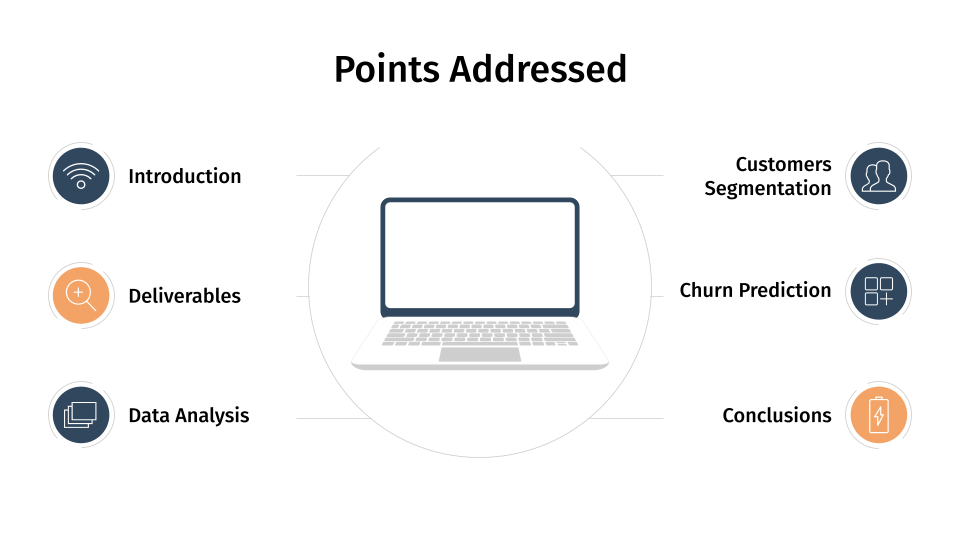
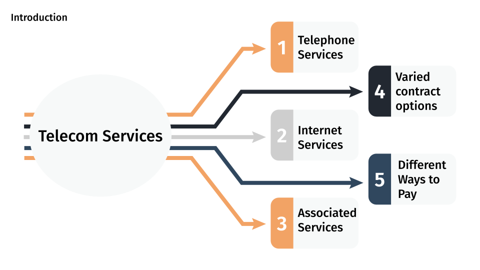
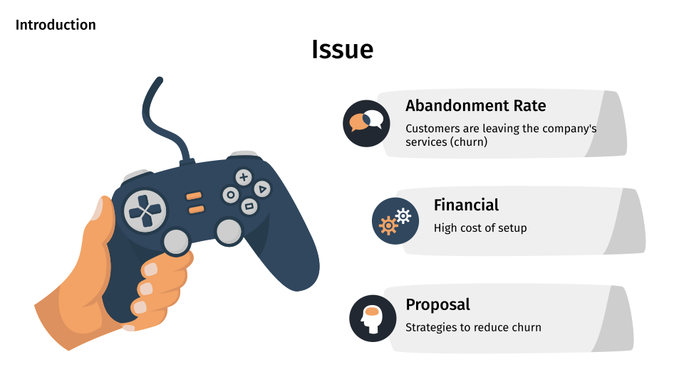
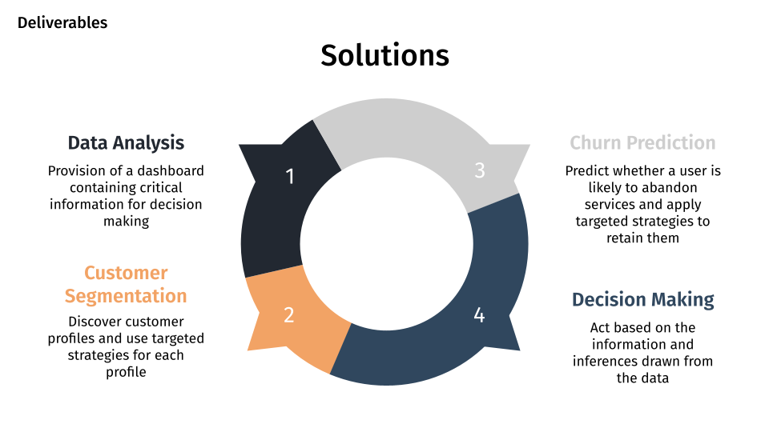
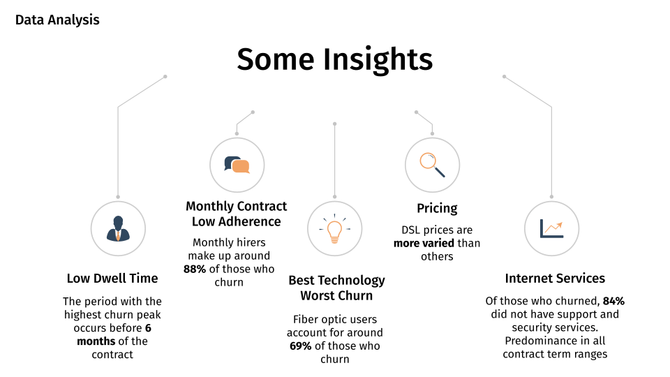
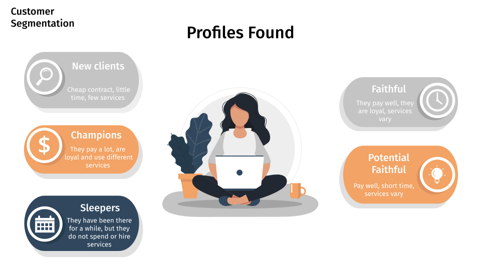
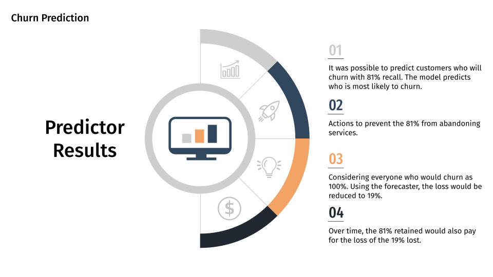
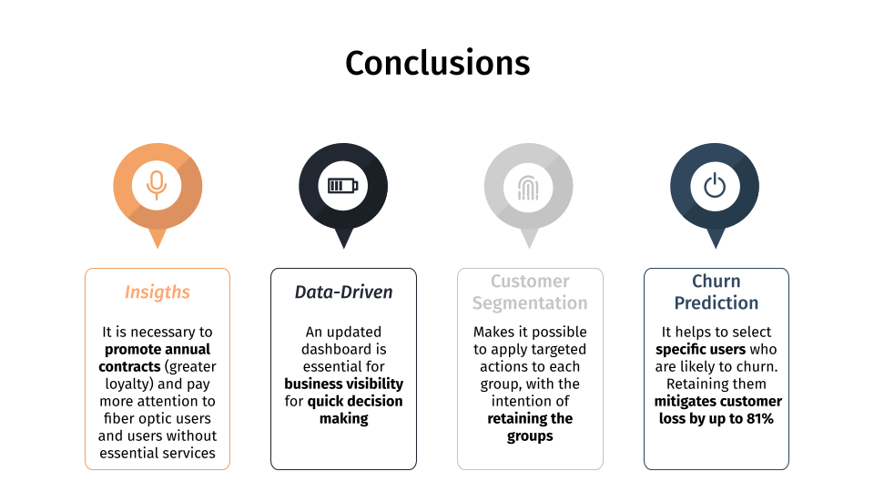

# :tada: DS002 - Churn Solutions (Telecom Client)

The current project is a basic approach of data analysis and machine learning modeling to get business insights and propose strategies of customer segmentation and churn prediction to mitigate the high churn rate.

### Objectives:
- Use the results of data analysis to generate valuable insights and increase company profits;
- Discover user trends and group them into clusters to make targetered approaches for each cluster;
- Predict the users most likely to abandon and retain those users.

# :tophat: Step 1. Business problem understanding

Data Dictionary:

- gender: Gender of the customer (Male or Female).
- SeniorCitizen: Indicator if the customer is a senior citizen or not (1, 0).
- Partner: Whether the customer has a partner (Yes, No).
- Dependents: Whether the customer has dependents (Yes, No).
- tenure: Number of months the customer has stayed with the company.
- PhoneService: Whether the customer has a phone service (Yes, No).
- MultipleLines: Whether the customer has multiple lines (Yes, No, No phone service).
- InternetService: Customer’s internet service provider (DSL, Fiber optic, No).
- OnlineSecurity: Whether the customer has online security (Yes, No, No internet service).
- OnlineBackup: Whether the customer has online backup (Yes, No, No internet service).
- DeviceProtection: Whether the customer has device protection (Yes, No, No internet service).
- TechSupport: Whether the customer has tech support (Yes, No, No internet service).
- StreamingTV: Whether the customer has streaming TV (Yes, No, No internet service).
- StreamingMovies: Whether the customer has streaming movies (Yes, No, No internet service).
- Contract: The contract term of the customer (Month-to-month, One year, Two year).
- PaperlessBilling: Whether the customer has paperless billing (Yes, No).
- PaymentMethod: The customer’s payment method (Electronic check, Mailed check, Bank transfer, Credit card).
- MonthlyCharges: The amount charged to the customer monthly.
- TotalCharges: The total amount charged to the customer.
- Churn: Whether the customer churned or not (Yes, No).

# :bar_chart: Step 2. Data analysis

Some descriptive data analysis to outline data characteristics and understand how information is arranged. An exploratory data analysis to address some business points and answer relevant questions.

Some questions raised:

**1) Do people who churn are mainly that with high tenure (used a lot and found a better service)?**
> Answer: No, people tend to change within the first few months of service.

**2) Do most people who drop out have a monthly contract (is it harder to stay loyal than an annual contract)?**
> Answer: Yes. An alternative is to promote more annual contracts (through discounts, offers, sweepstakes, etc.) to retain customers and generate loyalty while customers truly get to know the services and get closer to the company.

**3) Do most people who drop out use DSL or no internet service at all (they drop out due to limited resources)?**
> Answer: Answer: No, the fiber optic has the most churn rate.

**4) Are there pricing inconsistencies in the services provided (any service too expensive for a specific scenario)?**
> Answer: No inconsistencies were found, but we can say something that helps us to understand a little the aspect of question 3: although the prices are separable, even due to the quantity of services provided, the price of fiber optics is considerably higher than that of other internet services. The DSL prices are more varied.

# :capital_abcd: Step 3. Customers segmentation

Try to understand how the users are arrenged and how to do targetered strategies to retain each spefic group of users and increase their life time value.

The machine learning model found **5 ideal groups** for the data:

| Cluster | Description | Avg. Monthly Charges | Avg. Tenure | Avg. Internet Services |
| ---: | :---: | :---: | :---: | :---: |
| `New clients (3)` | Cheap contract, little time, few services | 27.23 | 11.53 | 0.23 |
| `Sleepers (2)` | They have been there for a while, but they do not spend or hire services | 25.71 | **54.39** | 0.17 |
| `Potential Faithful (4)` | Pay well, short time, services vary | **73.97** | 17.28 | 2.10 |
| `Faithful (0)` | Pay well, they are loyal, services vary | **74.23** | **55.22** | **3.10** |
| `Champions (1)` | Pay a lot, are loyal and use different services |  **99.11** | **61.48** | **4.98** |

The image below shows how groups are separable. Therefore, the clustering model will not group individuals ambiguously.

# :chart_with_upwards_trend: Step 4. Churn prediction

It was possible to predict with 81% recall whether the user will leave the company. A retention strategy is necessary to **mitigate up to 81% of churn**.

The image below shows the machine learning algorithm, the standardizer, the encoder, and the features preprocessed before model input.

Below, the confusion matrix, indicating that **the model can discover which 81% (377) of users are likely to churn**.

# :memo: Step 5. The business presentation

---

---

---

---

---

---

---

---

---

# :rocket: The end.
